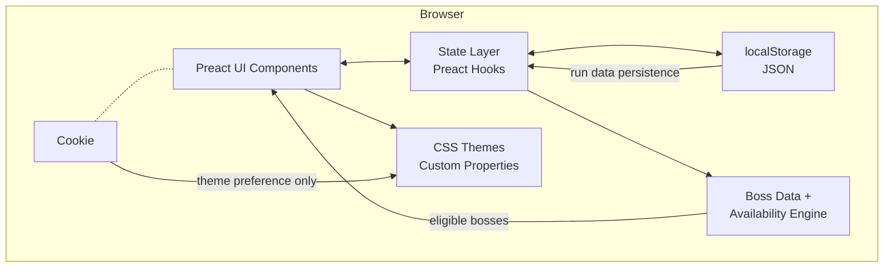

# Architecture

> **Status:** Ready for review

## Overview

Blind Keeper is a client-side single-page application for tracking boss blind encounters during a Balatro run. It runs entirely in the browser with no server-side component. Users can manage multiple concurrent runs, record which bosses they faced or rerolled at each Ante, and review run history — all persisted locally in the browser.

## High-Level Architecture



### Key Modules

1. **UI Components (Preact):** Render the boss selection grid, run management, Ante history, and settings. Responsive layout adapts to mobile/tablet/desktop.
2. **State Layer (Preact hooks):** Manages application state — current run, Ante progression, boss selections. Acts as the bridge between UI and persistence.
3. **Boss Data & Availability Engine:** Pure TypeScript module containing the static boss dataset and the logic to compute which bosses are eligible for a given Ante based on game rules and prior encounters.
4. **Persistence (localStorage):** Serializes/deserializes run data as JSON. Enforces storage limits (max 10 active runs, max 10 completed runs).
5. **Theme System (CSS custom properties):** Dark/light theme toggled by the user or derived from `prefers-color-scheme`. Preference stored in a cookie.

## Technology Stack

- **UI Framework:** Preact (~4 KB min+gzip) with hooks
- **Build Tool:** Vite (fast dev server, optimized production builds)
- **Language:** TypeScript
- **Styling:** Plain CSS with custom properties
- **Testing:** Vitest (unit), Preact Testing Library (component)
- **Persistence:** Browser localStorage (JSON serialization)
- **Hosting:** GitHub Pages (static build output)
- **Assets:** Boss blind icons stored locally as optimized images

## Data Model

### Boss Blind (static data)

```typescript
interface BossBlind {
  id: string;           // e.g., "the-hook"
  name: string;         // e.g., "The Hook"
  icon: string;         // path to local icon asset
  minAnte: number;      // minimum Ante where this boss can appear (1–8)
  isShowdown: boolean;  // true for Showdown Blinds (Ante 8, 16, 24, 32)
}
```

### Ante Entry (per-Ante record within a run)

```typescript
interface AnteEntry {
  anteNumber: number;         // the Ante level (1–39)
  facedBoss: string;          // boss ID that was played
  rerolledBosses: string[];   // boss IDs that were rerolled (in order)
}
```

### Run

```typescript
interface Run {
  id: string;               // unique identifier (UUID)
  name: string;             // user-provided name
  createdAt: string;        // ISO 8601 timestamp
  status: 'active' | 'completed';
  currentAnte: number;      // next Ante to play
  entries: AnteEntry[];     // sequential log of boss encounters
}
```

### App State (persisted to localStorage)

```typescript
interface AppState {
  activeRunId: string | null;   // ID of the currently selected run
  runs: Run[];                  // all runs (active + completed, bounded)
}
```

## State Management

State is managed via Preact hooks:

- **`useAppState()`** — custom hook that loads state from localStorage on mount, provides the current state, and exposes mutation functions that auto-persist changes.
- **`useBossAvailability(run, anteNumber)`** — computes the eligible boss list for a given Ante based on the run's history and game rules. Pure derivation, no side effects.
- All state mutations (add entry, edit entry, undo, change Ante, manage runs) go through the hook, ensuring localStorage stays in sync.

## Persistence

- **Mechanism:** Browser `localStorage`
- **Key:** Single key (e.g., `blind-keeper-data`) containing the full `AppState` as JSON
- **Limits:** Max 10 active runs + max 10 completed runs
- **Theme preference:** Stored in a cookie, separate from run data

## Deployment

- **Hosting:** GitHub Pages (initial); portable to any static host
- **Build:** `vite build` produces static assets in `dist/`
- **CI/CD:** GitHub Actions — lint, type-check, and test on every PR; auto-deploy to GitHub Pages on merge to `main`
- **Branching:** Gitflow — feature branches target `develop`; `develop` merges to `main` for release/deploy
- **Local Dev:** `vite dev` for local development with hot module replacement

## Constraints

- No server back-end
- No authentication, analytics, or user tracking
- No cookies beyond theme preference
- Minimal page weight; prioritize load speed
- Responsive layout for mobile, tablet, and desktop
- Accessibility considered in all UI decisions (semantic HTML, keyboard navigation, ARIA labels)
